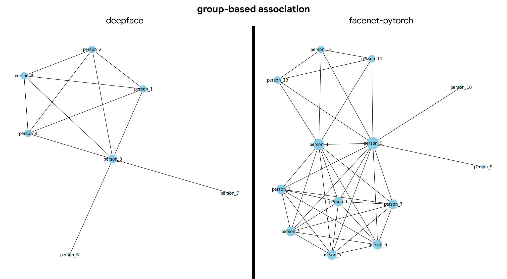

# Proof Of Concept

1. `poc.ipynb`: individualize + group-based association with facenet-pytorch
2. `poc_2.ipynb`: trying deepface, especially on emotion recognition
3. `poc_3.ipynb`: individualize + group-based association with deepface
4. `fer_finetune.ipynb`: finetuning vggface2 with FER dataset for emotion recognition -> bad result
5. `poc_4.ipynb`: individualize (facenet-pytorch) + emotion-based association with deepface (ongoing)

## Result

deepface presents a more streamlined association with fewer nodes and edges, suggesting a simplified grouping. This could indicate that it identifies fewer distinct groups or possibly merges certain entities more readily. On the other hand, facenet-pytorch displays a more intricate web of nodes and connections, hinting at a potentially more detailed and discerning classification mechanism. This might allow it to detect subtler differences or finer groupings within the data.
